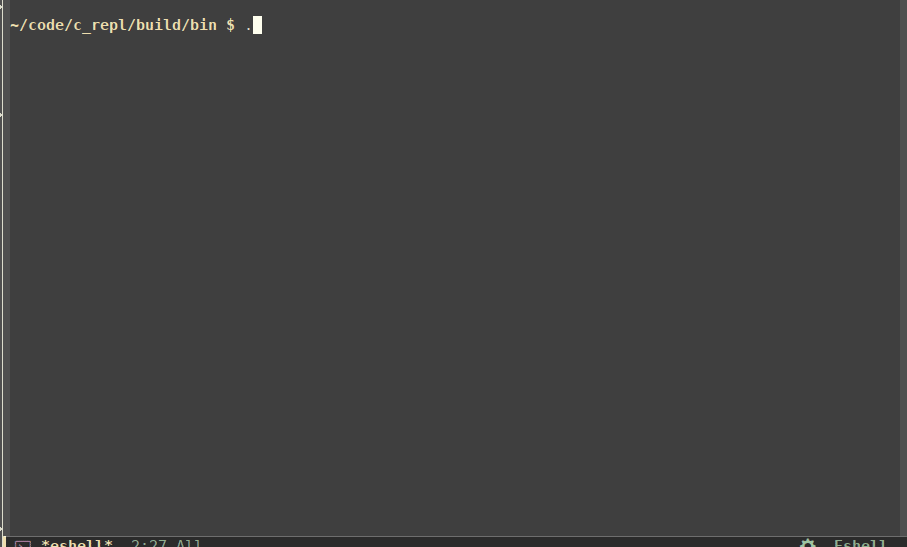

## Read-Compile-Run-Loop: tiny and powerful interactive C compiler (REPL) CLI



For C++ GUI/CLI/license version or license see [rcrl](https://github.com/Islam0mar/rcrl)

It uses the following special keywords:

- `.rawInput` toggle raw input, the same as cling.
- `.L` load a library.
- `.q` exit.
- `.flags ...` set new flags.
- `.f ...` append flags.
- `.clean` clean loaded libs.

## The Recipe 

- Text input is feed to clang.
- Traverse the parsed code for functions & variables definition "ignore errors".
- Add export prefix for them and put them in plugin.cpp.
- Every non-parsed text would be regarded as once in plugin.cpp.
- Append plugin.hpp with functions prototypes and extern variables.
- Load library with `RTLD_GLOBAL`, so variables can be reused.

## Test Code

```c
#include <stdio.h>

int test1() {
   printf("Hello World!\n");
   return 0;
}

.f -I/usr/include/SDL2 -D_REENTRANT
.LSDL2
#include <SDL2/SDL.h> 
#include <unistd.h>
  
int test2() { 
  
    // retutns zero on success else non-zero 
    if (SDL_Init(SDL_INIT_VIDEO) != 0) { 
        printf("error initializing SDL: %s\n", SDL_GetError()); 
    } 
    SDL_Window* win = SDL_CreateWindow("GAME", 
                                       SDL_WINDOWPOS_CENTERED, 
                                       SDL_WINDOWPOS_CENTERED, 
                                       300, 300, 0); 

    sleep(3);
    SDL_DestroyWindow(win);

    return 0; 
} 
```
## TODO

- [ ] remove .L and extract that from -l
- [ ] better support for copy/paste
- [ ] better recovery from error rather than assert
- [ ] resolve license: GNU General Public License
- [x] use libclang
- [x] replace tiny process with boost process
- [ ] rewrite test cases
- [x] smarter header generation for functions and variables
- [x] support struct,enum,... def.
- [ ] allow redefinition.
- [ ] test on windows
- [ ] check for errors in compilation 
- [ ] check for errors in compiler command
- [ ] add timeout for compilation
- [ ] fix parser int x = 0!!
- [x] add an option to add link flags
- [x] ~~add option to use [TCC](https://github.com/TinyCC/TinyCC)/[zapcc](https://github.com/yrnkrn/zapcc)~~, doesn't compile all libs

## Copyright

Copyright (c) 2018 Viktor Kirilov<br />
Copyright (c) 2020 Islam Omar (io1131@fayoum.edu.eg)
